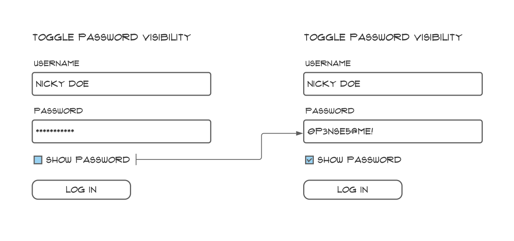
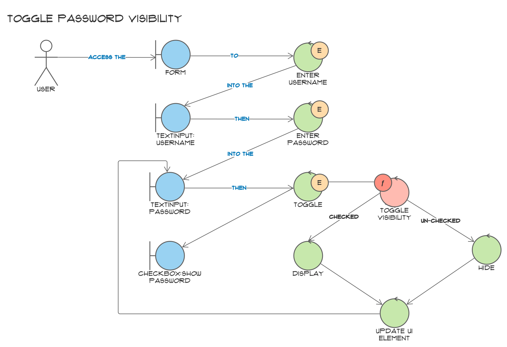
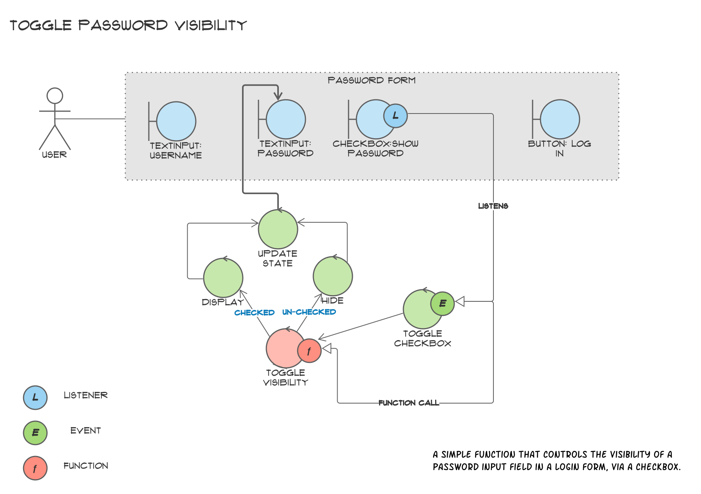

# Grokking Simplicity #

> Functional programmers prefer data to calculations and prefer calculations to actions.

[*Grokking Simplicity*](https://grokkingsimplicity.com/) is the title of a wonderful book, published in 2021, to teach an approach to software development, specifically functional programming. I discovered the book while attending [Chris Ferdinandi's](https://gomakethings.com/) Vanilla JS Academy, and soon found myself moving away from my Java trained OOP approach and learning to think like a functional programmer. <!--truncate-->This book teaches an approach to problem decomposition, and introduced me to classify code and problems into:

- Actions
- Calculations and
- Data

## Adapting what I learnt ##

Because I am a Business Analyst, who specialise in UI Systems Design, I am tasked with documenting wire-frames from low-fidelity to high-fidelity, and naturally I use UML diagrams to document my system design and requirements. But remote work can make it difficult to collaborate with developers therefore I am always looking for ways to improve the communication between the business and the development team.

The more I used the Grokking Simplicity methodology, and tasked with doing both the technical and UI design, on a particular project, I chose to use Robustness Diagrams to communicate these designs.  Robustness Diagrams are a type of visual modeling technique, normally used in software engineering and system analysis to ['analyze and design the structural and behavioral aspects of a system'](https://sparxsystems.com/enterprise_architect_user_guide/15.2/model_domains/iconix_process.html). They are primarily used within the context of the ICONIX process, a streamlined, use case-driven software development methodology.

I ~~adapted~~ `hacked` [Robustness Diagram](https://www.visual-paradigm.com/guide/uml-unified-modeling-language/robustness-analysis-tutorial/) notation by extending the symbol for the controller object to represent either calculations or events (actions). I appended the controller symbol with the letter `‘e’` for event and `‘f’` to depict make a function. The letter `'l'` is used to extend the symbol used for a  boundary object,  or user interface. This indicates that an event listener is coupled to a particular UI component, in our example below, a checkbox.

## Example ##

I chose a very simple function that toggles the visibility of a password field, as example to illustrate how this notation can be used to document a UI design.

### User Story ###

> As a user, I want to be able to toggle the visibility of my password so that I can see what I am typing.

### Wire-frame ###



### Robustness Diagram ###



It’s a relatively simple diagram and once the engineers can read and interpret it, it serves a dual purpose such that it teaches sound programming principles as well as clear specifications.

More experienced developers and architects should be able to document and adopt this notation and generate designs that originate from UI mocks.

I have used this notation to document the entire system design of a fairly complex Enterprise Application.
This was done through light-weight workshops with the development team, and the diagrams were used to document the design and requirements and design together.

It is important to note, that one typically would not document UIs at this level of detail in a Robustness Diagrams, but I found it to be a very effective way to communicate the design and requirements to the development team.



### Code ###

```javascript
//
// Variables
//

// Get the password toggle
const toggle = document.querySelector('#show-password');

// Get the password field
const password = document.querySelector('#password');


//
// Functions
//

/**
 * Toggle the visibility of a password field
 * based on a checkbox's current state
 * 
 * @param {HTMLInputElement} checkbox The checkbox
 * @param {HTMLInputElement} field The password field
 */
function togglePassword (checkbox, field) {
  field.type = checkbox.checked ? 'text' : 'password';
}

/**
 * Handle change events
 */
function handleChange () {
  togglePassword(this, password);
}


//
// Inits & Event Listeners
//

// Handle change events
toggle.addEventListener('change', handleChange);
```
View the code in action on [Code Pen](https://codepen.io/Izmargad/pen/poOKLyZ)

### Credits ###

- [Grokking Simplicity](https://grokkingsimplicity.com/)
- [Robustness Diagram](https://www.visual-paradigm.com/guide/uml-unified-modeling-language/robustness-analysis-tutorial/)
- [Vanilla JS Academy](https://vanillajsacademy.com/)
- [Kieran Barker](https://github.com/kieranbarker)
- [Chris Ferdinandi](https://gomakethings.com/)